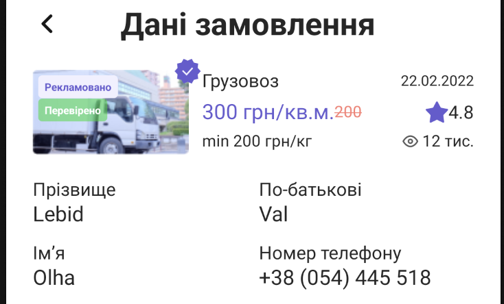

# Вітаю в тестовому проєкті 

### Для запуску проєкта виконати декількі дій 

npm install --force
or yarn install 

`Android:`

adb reverse tcp:8081 tcp:8081

npx react-native start 

`Ios`: 

немає особливих вказань

Всі додаткові компоненти які є в проєкті такі як: `<Button />`, `<Text />`, `<Input />`, `<Checkbox />` - 
це виконано для легшої адаптації цих компонентів в усьому проєкті при зміні дизайна чи шрифта.

Всі іконки виконано за допомогою бібліотеки `react-native-svg` - для чіткої картинки на в emulator,
для того щоб не залежно від платформи на якому ви дивитесь проєкт іконки виглядали однаково, не було проблем з 
відображженям картинки на різних типах ємуляторах.

## Функціонал

`size()`, `fontSize()` - Повертає значення плотности пікселей телефона, масштабу шрифта та враховуючи ширину єкрана.

`getLongitudeDelta()` - Динамічо визначае якє сама має бути значення `longitudeDelta` для регіона яке 
ми вибираемо на карті.

## Google maps

При переході зі скріна **Order** => **OrderData** на мапі відображаеться траєкторія маршрута, якщо повернутися на скрін 
**Order** та змінити адресу "Загрузки" чи "Вигрузки" та знову перейти нв **OrderData** траєкторія маршруту 
змінюються динамічно так самє як динамічно визначае яким має бути  `longitudeDelta` та `latitudeDelta` в залежності від 
повної відстані маршрута. 

Для ios та android імплентована ондакова `customMapStyle` тема

## Контактні данні 

Якщо користувач не в введе свох контактні даанні на скріні **Order**, на скріні **OrderData** 
він буде бачити 

Поля будуть зявлятися тількі якщо юзер їх заповнить на попередньому скріні в блоці

**Контактні данні** 

## Календар 

В headers календаря є дублюючи кнопки `'Month'` та `'Year'`. 

Та також можно перейти на блок `'Month'` коли натиснути на **сьогоднішню дату** в headers календаря,
наступне натискання на цю ж кнопку відкриє блок `'Year'`,
a вже наступне натискання на цю ж кнопку відкриє блок `'Days'`,

## Розрахунок повної ціни на замовлення 

**Подача транспорту та Послуга єкспедітора**: є дефолтним значенням 2000 грн.

**Маршрут загрузки-вигрузки**: 1км - 20грн(кожен раз коли користувач повертаеться на 
попередній скрін **Order** та змінює адресу загрузки чи вигрузки повно ціна буде динамічно 
перераховуватися як і траєкторія маршрута на карті)

**Послуга грузчиків**: 1 грузчик за 1 годину роботи - 100грн.

